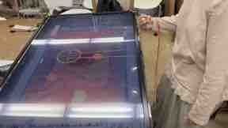
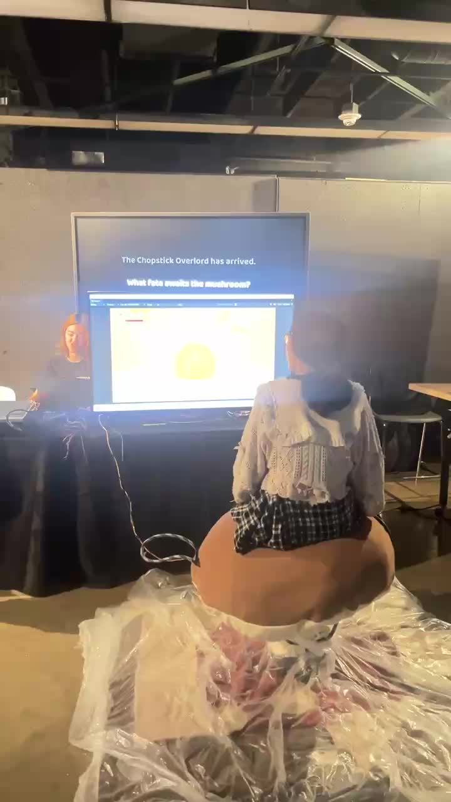

# Alt2 Team C — transcript with media

以下正文来自屏幕逐段核对的聊天转录；媒体表随后附上。

## Screen-verified transcript

# Alt2 Team C — visually paired transcript (screen-verified coverage)

The entries below are paired from the visible chat layout: date divider, sender avatar/name, bubble alignment, and media thumbnail. Where the original media is deleted, expired, or remains encrypted as `.dat`, that status is kept explicit instead of inventing a decode.

## 2026-03-31

**20:56 — 软隽辰**

- Media: blue image with a large white `2`.
- Original: `media_original/2026-03/Img/5b573b6121235ef46cea237d7e087279.dat`
- Pairing confidence: high.

## 2026-04-01

**19:15 — 愿有月光相伴**

- Media: wide open-book/storyboard image.
- Original: `media_original/2026-04/Img/fc00031346fdf0805b28f73477aba757.dat`
- Pairing confidence: medium.

**After the 19:15 divider — Jason Tan**

- Media: hotpot/table image.
- Original candidate: `media_original/2026-04/Img/c13efed5e12b69f8a954be885faec5c9.dat`
- Pairing confidence: low; exact bubble time requires another frame.

## 2026-04-03

**18:19 — 刹那繁红**

- Media: 26-second video showing an arcade/table game scene.
- Original video: missing from local storage.
- Readable fallback thumbnail: `decoded_media/2026-04-03_1819_刹那繁红_video-thumb.jpg`
- Pairing confidence: high.

## 2026-04-21

**00:23 — pingpingdandancaishizhen**

- Media: two-panel storyboard image visible in the left-aligned bubble.
- Original: `media_original/2026-04/Img/32221cad073390f5602662c2aacc3e18.dat`
- Pairing confidence: medium.

## Screen-OCR verified frame — 2026-04-01

- Juliaaaaaa_桐: 这个打光是可以的
- 2026-04-01 20:52 — Jason Tan: @乌冬车 试一下这个
- Jason Tan: 文件《蘑菇开始页面.fbx》, 10.7K, 微信电脑版
- Jason Tan: 图片（引用 Juliaaaaaa_桐：“需要两个表情，一个开心的一个不开心的”）；画面为黑底上的方形角色表情，第一张是不开心表情。
- Jason Tan: 图片（引用同一条 Juliaaaaaa_桐消息）；画面为黑底上的方形角色表情，第二张是开心表情。

这段内容由微信主聊天窗口的连续屏幕画面确认，发送者通过头像、姓名和气泡位置配对。

## Screen-OCR verified frame — 2026-04-18

- 18:09 — 软隽辰：空格
- 18:07 — DUO：按键盘就行
- 18:07 — DUO：能不能加一个教程跳过功能
- 17:52 — 软隽辰：改了
- 17:52 — 软隽辰：记得之后再 enable 回去
- 17:47 — 软隽辰：还不行的话就 movement 脚本有问题
- 17:47 — 软隽辰：你去锅和桌子1里面把那四个 cube 禁用了试试
- 17:46 — DUO：然后结算页面的字还是全都摞在一起的

## Screen-OCR verified frame — 2026-04-23 to 2026-05-11

- 2026-04-23 13:19 — Jason Tan：转咯
- 2026-04-23 13:19 — pingpingdandancaishizhen：感谢
- 2026-04-23 13:19 — Jason Tan：👌
- 2026-05-11 11:15 — 刹那繁红：下周我们要决定名单了，谁还要继续项目？
- 2026-05-11 11:15 — 刹那繁红：@Mention All
- 2026-05-11 19:32 — 刹那繁红：Justin 这正在问，然后在 summer 他会有 workshop（引用“下周我们要决定名单了，谁还要继续项目？”）
- 2026-05-11 19:40 — Jason Tan：我不弄了谢谢哈
- 2026-05-11 19:40 — 愿有月光相伴：我应该也不弄了我去研究生了
- 2026-05-11 19:41 — 刹那繁红：👌
- 2026-05-11 19:42 — 软隽辰：我不来

## Screen-OCR verified frame — 2026-04-22

- 17:55 — DUO：@愿有月光相伴 订书机放在哪了
- 17:57 — 愿有月光相伴：我放回去了你们还有需要吗
- 17:59 — DUO：ok
- 22:28 — DUO：图片（表格截图，包含 poster print、plastic sheet、rope、laser cut 等项目及 Arrived 状态）
- 22:28 — DUO：看看有没有漏算的
- 22:28 — DUO：然后发一下 zelle @pingpingdandancaishizhen @愿有月光相伴
- 22:30 — pingpingdandancaishizhen：6266377713
- 23:26 — pingpingdandancaishizhen：没有漏算的（引用 DUO“看看有没有漏算的”）

## Screen-OCR verified frame — 2026-04-21 19:59–20:03

- 19:59 — DUO：看看能打开吗 @Jason Tan @愿有月光相伴
- 19:59 — DUO：文件《screen-capture (44).webm》，教程的录屏
- 20:00 — DUO：蘑菇的
- 20:02 — Juliaaaaaa_桐：这个黄色没有很亮（引用 DUO“感觉黄色暗啊”）
- 20:03 — Juliaaaaaa_桐：图片，手机屏幕上的黄色方块/颜色测试画面
- 20:03 — Juliaaaaaa_桐：图片，手机屏幕上的角色/版面测试画面

## Screen-OCR verified frame — 2026-04-21 17:54–17:57

- 17:54 — Jason Tan：故事肯定不能砍掉的，有几页故事就要有几句对应的文字内容
- 17:55 — Jason Tan：yea（引用软隽辰“句子数量只要不超过你的页数就行”）
- 17:56 — 软隽辰：还有筷子最后我砍掉两页
- 17:57 — 软隽辰：9秒播一个3帧动画实在太长了
- Juliaaaaaa_桐：文字脚本：
  1. Wake up! Wake up!
  2. Caught and dropped into the pot. Don’t worry—we can survive.
  3. Three lives. Survive the timer to win.
  4. Stay too long, you’ll overcook. Lose control, float up—and get spotted.
  5. Watch your heat meter. Don’t let it max. Surface to cool down.

## Screen-OCR verified frame — 2026-04-21 17:14–17:20

- 17:14 — Juliaaaaaa_桐：Stay too long, and you’ll overcook. Lose control, float to the surface—and get spotted.
- 17:14 — Juliaaaaaa_桐：Watch your heat meter. Don’t let it max out. Surface often to cool down. Keep the meter from filling up.
- 17:14 — Juliaaaaaa_桐：Press the button to push yourself upward.
- 17:14 — Juliaaaaaa_桐：Lean forward or back to move. Shift left and right to aim your view.
- 17:14 — Juliaaaaaa_桐：蘑菇是调整了4张
- 17:19 — pingpingdandancaishizhen：筷子也有调整的我都放在gdc里了可以先看一下，我这边电脑有点死了，等他好了我也可以发文本😬
- 17:20 — pingpingdandancaishizhen：gdd😬

## Screen-OCR verified frame — 2026-04-20 20:28–2026-04-21 00:23

- 20:28 — DUO：哪里说的
- 20:28 — 软隽辰：没说有 presentation
- 20:30 — Juliaaaaaa_桐：是没有说
- 20:30 — Juliaaaaaa_桐：🤔
- 20:30 — 软隽辰：只说了最后一节课要互相玩其他组的项目
- 20:30 — Juliaaaaaa_桐：哦哦好
- 20:31 — Juliaaaaaa_桐：那太好了
- 2026-04-21 00:23 — pingpingdandancaishizhen：图片，两格 storyboard（左格人物/锅，右格筷子和食物）

## Screen-OCR verified frame — 2026-04-19

- 12:56 — 刹那繁红：idk
- 12:56 — 刹那繁红：准备准备吧
- 13:38 — pingpingdandancaishizhen：图片，现场屏幕/展示场景
- 13:38 — pingpingdandancaishizhen：视频，时长 0:03，现场屏幕/展示场景
- 14:17 — 愿有月光相伴：图片（展示/屏幕画面，下一屏继续核对）

## Screen-OCR verified frame — 2026-04-18 17:12–17:24

- 17:12 — 软隽辰：什么情况
- 17:12 — 软隽辰：说清楚一点
- 17:14 — DUO：筷子的
- 17:14 — DUO：到右边过不去
- 17:24 — 软隽辰：好了
- 17:24 — 软隽辰：你再试试
- 17:24 — 软隽辰：push 完记得要跟我讲
- 17:25 — 软隽辰：我这边又有 conflict 了
- 17:25 — DUO：不行

## Screen-OCR verified frame — 2026-04-16 20:26–20:32

- 20:26 — 愿有月光相伴：我明天早点起吧看能不能后面在山校做完再去上课
- 20:27 — 愿有月光相伴：会很麻烦吗（引用刹那繁红“我明天可以去南校取”）
- 20:30 — 刹那繁红：因为我也要做筷子
- 20:30 — 刹那繁红：我要给你们周六准备一下
- 20:30 — 刹那繁红：要不然周六基本上就裸奔了
- 20:32 — 愿有月光相伴：图片/贴纸“oh…”
- 20:32 — 愿有月光相伴：哦哦 okok 但是你要是太忙了的话我去弄一下也可以，感觉你的那个重要点
- 系统记录：Juliaaaaaa_桐 撤回了一条消息

## Screen-OCR verified frame — 2026-04-16 20:06–20:15

- 20:06 — 愿有月光相伴：我明天大概率是切不了因为我和 Jason 有课
- 20:07 — 愿有月光相伴：你们知道 Model Shop 开到几点吗？如果开得比较晚的话我现在可以去找他们
- 20:07 — DUO：南校的还开着
- 20:08 — DUO：开到十点
- 20:08 — 愿有月光相伴：那我现在开过去吧
- 20:08 — DUO：太好了
- 20:15 — 愿有月光相伴：要跟他们说切成啥样的呀
- 20:15 — DUO：应该是留一圈白边？
- 20:15 — DUO：@Jason Tan

## Screen-OCR verified frame — 2026-04-16 16:25–16:26

- 16:25 — Juliaaaaaa_桐：之前不是说蘑菇方一个筷子方一个
- 16:25 — Jason Tan：@愿有月光相伴 可以问问 chloe 她们组打印的尺寸和纸张吗
- 16:25 — 软隽辰：没时间画了可能
- 16:25 — Juliaaaaaa_桐：之前说是区分下，还是说这个就当作主视觉用了
- 系统记录：Jason Tan 撤回了一条消息
- 16:25 — Jason Tan：就放一个大立牌就够了我觉得
- 16:26 — Jason Tan：筷子那边很难做出跟食物一样效果
- 16:26 — Jason Tan：表情什么的加上去好奇怪
- 16:26 — Jason Tan：而且就筷子一个物体
- 16:26 — Jason Tan：确实

## Screen-OCR verified frame — 2026-04-16 01:56–16:10

- 01:56 — DUO：可以的
- 01:56 — DUO：尽量早一点
- 01:58 — 愿有月光相伴：行我现在还是回家吧这样我明天就可以早点发给你们
- 16:10 — Jason Tan：文件《poster.psb》，144.3M，未下载
- 16:10 — Jason Tan：图片，蘑菇/食物角色海报草图
- 16:10 — Juliaaaaaa_桐：这个是要搞立体的立牌还是平面的 poster
- 16:10 — Jason Tan：平面

## Screen-OCR verified frame — 2026-04-15 01:49–02:02

- 01:49 — DUO：我收到了
- 01:49 — DUO：@刹那繁红
- 01:53 — Jason Tan：我现在转你们哈
- 01:53 — DUO：好嘞
- 01:55 — Jason Tan：Rebecca 和 red 的 Zelle 是多少啊
- 01:55 — DUO：6266377713rebecca
- 01:55 — DUO：3233768339red
- 01:59 — Jason Tan：okk！
- 02:02 — Jason Tan：图片（转账/支付记录截图，下一屏继续核对）

## Screen-OCR verified frame — 2026-04-14

- 14:19 — 愿有月光相伴：要有表情吗（引用软隽辰“目前是肉丸，鱼豆腐，羊肉卷，青菜还有辣椒”）
- 14:19 — 软隽辰：可以要
- 17:18 — 软隽辰：@pingpingdandancaishizhen 有的左右顺序有问题，图还镜像了
- 17:18 — 软隽辰：图片，多个 storyboard 画面拼图
- 17:18 — 软隽辰：视频，时长 0:31，教程/动画播放画面

## Screen-OCR verified frame — 2026-04-11

- 03:16 — 愿有月光相伴：好
- 03:17 — 软隽辰：目前是肉丸，鱼豆腐，羊肉卷，青菜还有辣椒
- 03:18 — 愿有月光相伴：要用在哪啊
- 03:18 — 愿有月光相伴：结束页面吗
- 03:18 — 软隽辰：不是
- 03:18 — 软隽辰：是一个 combo 系统
- 03:19 — 软隽辰：就是连续吃同一种食物会触发 combo
- 16:30 — Jason Tan：@Bedi storyboard 的视频可以给我看看嘛
- 16:30 — Jason Tan：是你在弄嘛还是……

## Screen-OCR verified frame — 2026-04-07–04-08

- 21:43 — DUO：那也行
- 21:43 — pingpingdandancaishizhen：语音，8 秒
- 21:44 — DUO：没事先不买了
- 21:44 — pingpingdandancaishizhen：好的 👌
- 21:45 — pingpingdandancaishizhen：语音，10 秒
- 21:46 — pingpingdandancaishizhen：图片，手持红色包装的防护手套
- 2026-04-08 15:05 — DUO：我在学校做作业

## Screen-OCR verified frame — 2026-04-05–04-07

- 2026-04-05 22:04 — pingpingdandancaishizhen：哦我发 dc 了
- 22:04 — pingpingdandancaishizhen：那我再发一遍
- 22:04 — 刹那繁红：嗯嗯
- 22:04 — 刹那繁红：我建议你直接 share 到咱们的那个 google drive
- 22:04 — pingpingdandancaishizhen：OKOK
- 22:04 — pingpingdandancaishizhen：视频，时长 0:35，教室/电脑屏幕录制
- 2026-04-07 15:35 — Juliaaaaaa_桐：图片，蘑菇与筷子/食物的彩色设计草图

## Screen-OCR verified frame — 2026-04-02–04-03

- 2026-04-02 23:45 — DUO：btw 教程 bedi 说已经做好啦
- 23:45 — pingpingdandancaishizhen：我可以来的
- 23:45 — DUO：好的好的
- 23:57 — Juliaaaaaa_桐：我也来的
- 2026-04-03 00:08 — Jason Tan：我和 Jay 有课来不了了
- 17:44 — pingpingdandancaishizhen：@Jason Tan @愿有月光相伴 今天因为一些原因没能测成，所以我们现在暂定周天下午再测一次，你们看可以吗
- 18:19 — 刹那繁红：视频，现场街机/桌面游戏画面，时长约 0:26

## Screen-OCR verified frame — 2026-04-01 20:45–20:52

- 20:45 — Jason Tan：图片，黑底上的方形角色，不开心表情
- 20:45 — Juliaaaaaa_桐：需要两个表情，一个开心的一个不开心的
- 20:45 — Juliaaaaaa_桐：最好有一点点透视
- 20:45 — Juliaaaaaa_桐：这个打光是可以的
- 20:52 — Jason Tan：@乌冬车 试一下这个
- 20:52 — Jason Tan：文件《蘑菇开始页面.fbx》，10.7K

## Screen-OCR verified frame — 2026-03-31 20:42–20:47

- 20:42 — 愿有月光相伴：图片，红色打开的书/故事板插图（连续两张）
- 20:47 — 软隽辰：图片，书本/页面导出格式参考（深色封面与木色内页）

## Screen-OCR verified frame — 2026-03-31 19:27–19:37

- 19:27 — Jason Tan：沃日
- 19:27 — Jason Tan：blender 闪退
- 19:27 — Jason Tan：东西没了
- 19:27 — Jason Tan：下午演了这个，另一个结局刚刚在改，结果突然闪退东西没了草
- 19:27 — Jason Tan：图片，锅/桌面场景与食物布局
- 19:27 — Jason Tan：整个文件都无了
- 19:37 — Jason Tan：现在唯一的办法就是，无论蘑菇玩家还是锅，这些木板上的食物数量都按照上面这张图的设定不变，咱就不纠结吃得多少食物就省的少这个细节了

## Screen-OCR verified frame — 2026-03-30 22:27–23:04

- 22:27 — pingpingdandancaishizhen：这个锁好像美术还没有给
- 22:27 — Jason Tan：等下哈
- 22:36 — Jason Tan：图片，锁头图标
- 系统记录：pingpingdandancaishizhen 撤回了一条消息
- 22:36 — pingpingdandancaishizhen：好嘞
- 23:04 — pingpingdandancaishizhen：@Jason Tan 好像筷子最后的结算建模有改动，盘子内要留地方给文字，请问有图片提供不
- 23:04 — pingpingdandancaishizhen：图片，结算页面/盘子与文字区域草图

## Screen-OCR verified frame — 2026-03-30 19:28–19:33

- 19:28 — pingpingdandancaishizhen：放了一下 tutorial 的 ui，瞄准用的 cursor 觉得最好不要用黑色因为咱们落底比较深 artist 看方便改一下吗
- 19:28 — pingpingdandancaishizhen：然后筷子的话咱们有单独的筷子建模不，还是说也是 2d 呢？
- 19:28 — pingpingdandancaishizhen：@Jason Tan @愿有月光相伴
- 19:28 — DUO：有筷子建模
- 19:28 — DUO：2d 也有
- 19:28 — pingpingdandancaishizhen：好嘞
- 19:33 — pingpingdandancaishizhen：那这个看可以一下吗（引用 tutorial UI 消息）

## Screen-OCR verified frame — 2026-03-30 17:03–17:10

- 17:03 — Jason Tan：玩家看得清楚些
- 17:03 — 愿有月光相伴：font 我没画我随便在 figma 里面找的
- 17:03 — 愿有月光相伴：你们可以调一下
- 17:03 — Jason Tan：@Juliaaaaaa_桐 @pingpingdandancaishizhen
- 17:10 — DUO：视频，时长 0:02，游戏画面
- 17:10 — DUO：笑鼠
- 17:10 — DUO：@愿有月光相伴

## Screen-OCR verified frame — 2026-03-30 15:34–15:51

- 15:34 — 愿有月光相伴：那我觉得可以加点颜色让他们更能知道这是热度
- 15:34 — 愿有月光相伴：图片，蘑菇＋心形图标＋热度条
- 15:45 — DUO：能不能放在 frame 里看一下大小
- 15:45 — 愿有月光相伴：我 figma frame 了
- 15:51 — Juliaaaaaa_桐：可以可以（引用“那我觉得可以加点颜色让他们更能知道这是热度”）
- 15:51 — Juliaaaaaa_桐：要有危险的感觉
- 15:51 — 刹那繁红：目前这个事情应该是 ixd 在 grey box 里确定好了位置大小，美术画的时候完全照着你们的大小画，最后我们程序做的时候就只要执行你们设计好的内容就可以了

## Screen-OCR verified frame — 2026-03-30 14:58

- 14:58 — DUO：图片，灰盒/教程界面示意图（顶部计时器与中心角色）
- 14:58 — DUO：时钟先按照这个大小画吧
- 14:58 — DUO：他们可能在做别的 还没回我
- 14:58 — DUO：灯亮度我再去问问
- 14:58 — 愿有月光相伴：行
- 14:58 — 刹那繁红：图片，蘑菇角色图
- 14:58 — 刹那繁红：笑死我了
- 14:58 — 刹那繁红：这个是 ixd 他们做的哈哈哈哈

## Screen-OCR verified frame — 2026-03-30 14:34–14:42

- 14:34 — DUO：@愿有月光相伴 和 cooklevel 一起画一下
- 14:34 — 刹那繁红：图片，蘑菇角色
- 14:34 — 刹那繁红：感觉就是纹理光影感可能太强了
- 系统记录：刹那繁红撤回了一条消息
- 14:34 — 刹那繁红：可以看一下感觉这个方向能用吗？
- 14:34 — 刹那繁红：图片，蘑菇＋心形图标的蓝底构图
- 14:34 — 刹那繁红：我可以让它纹理密度再低一些，我出个图
- 14:42 — DUO：图片，界面/设计截图

## Screen-OCR verified frame — 2026-03-30 14:22

- 14:22 — DUO：这和 ui 设计的不一样吧
- 14:22 — DUO：图片，灰盒计时器显示 03:00 的界面
- 14:22 — 软隽辰：是说美术风格吗
- 14:22 — DUO：之前不是这样的嘛
- 14:22 — 软隽辰：ok
- 14:22 — 软隽辰：我以为是针钟
- 14:22 — DUO：oo
- 14:22 — DUO：@Juliaaaaaa_桐 @pingpingdandancaishizhen 你们尺寸确定了吗（引用 Jason Tan“之前因为 ui 的灰阶图上尺寸没确定所以还没画”）

## Screen-OCR verified frame — 2026-03-30 14:09

- 14:09 — 刹那繁红：可以，咱们应该想要的是那种纯表面布纹的那种感觉？
- 14:09 — 刹那繁红：这个像是针织
- 14:09 — Jason Tan：这个我记得是特效吧（引用刹那繁红的材质参考图）
- 14:09 — Jason Tan：我们现在也要把它变成 3D 了嘛
- 14:09 — 刹那繁红：是的
- 14:09 — 刹那繁红：哦哦没有，就是我拿我之前说的工具给咱们 demo 一下看看我们要的是什么风格
- 14:09 — 刹那繁红：之前我不是提了这个工具但是我没做 demo 么，我就拿现在画好的图做了一下
- 14:09 — Jason Tan：噢噢
- 14:09 — Jason Tan：那这个布料风格还会用在其他什么地方吗
- 14:09 — Jason Tan：我感觉这又多出来了一种视觉风格

## Screen-OCR verified frame — 2026-03-30 12:31–13:29

- 12:31 — DUO：我们 cooklevel 现在长什么样啊
- 12:31 — DUO：@pingpingdandancaishizhen
- 13:29 — pingpingdandancaishizhen：cooklevel 我没记错的话是这个小火苗的样子（引用 DUO 的火苗/条形图）
- 13:29 — DUO：所以是这个配上这个小火苗的 bar 吗（引用 Juliaaaaaa_桐的蘑菇＋心形图）
- 13:29 — pingpingdandancaishizhen：是的
- 13:29 — DUO：ok
- 13:29 — DUO：jay 可以画一下么

## Screen-OCR verified frame — 2026-03-30 12:09–12:14

- 12:09 — DUO：是蘑菇煮了没有的那个显示
- 12:09 — DUO：图片，粉红色 cooklevel/热度条示意
- 12:09 — DUO：之前长这样来着
- 12:14 — 愿有月光相伴：哦这个好像目前没人画 筷子的帧线条当时是 Rebecca 做的
- 12:14 — DUO：ok
- 12:14 — 愿有月光相伴：我还以为配套给他们做了
- 12:14 — DUO：@pingpingdandancaishizhen
- 12:14 — DUO：我确认一下

## Screen-OCR verified frame — 2026-03-29 16:40–16:46
- 16:40 — Juliaaaaaa_桐：那个纹理是在 figma 里加的吗？
- 16:40 — Juliaaaaaa_桐：我可以这里处理好直接给你 png。
- 16:40 — 刹那繁红：对，这个图抠得出来。（OCR 中“抠/捡”字形略有不确定）
- 16:40 — 刹那繁红：也可以。
- 16:40 — Juliaaaaaa_桐：感觉会更方便点。
- 16:40 — 刹那繁红：那你做吧。
- 16:40 — Juliaaaaaa_桐：好好稍等。
- 16:40 — 刹那繁红：然后目前已经有一些高保真的资产了，咱们记得 update 一下 flow 里面低保真的部分替换成新的 assets。
- 16:40 — 刹那繁红：要不然现在会只能自己在 unity 里面调，也不知道到底新的主板在哪里好看。
- 16:40 — DUO：图片（被引用/缩略图，内容未在当前帧完整显示）。
- 16:40 — Juliaaaaaa_桐：好。

## Screen-OCR verified frame — 2026-03-29 16:24–16:29
- 16:24 — 刹那繁红：我和朵姐今天在学校 242 做筷子的新版探控，想要加入的可以来。
- 16:29 — DUO：@愿有月光相伴 @Jason Tan 我们有画 2d 的筷子吗？
- 16:29 — DUO：图片，Shroom Pot Showdown 的筷子/交互 UI 草图（手指按压中央方块，左右两侧有箭头/控件）。

## Screen-OCR verified frame — 2026-03-28 21:18–21:26
- 21:18 — Jason Tan：那我觉得灯关好后，3D 效果是很不错的。
- 21:18 — DUO：好滴。
- 21:18 — Jason Tan：会比 2D 更出效果的。
- 21:18 — Jason Tan：而且蘑菇挂了的表情。
- 21:18 — Jason Tan：我之前有做过 3D 的。
- 21:18 — Jason Tan：可以换上去。
- 21:18 — DUO：太好喽。
- 21:26 — DUO：@Juliaaaaaa_桐 @pingpingdandancaishizhen 现在是所有的人物形象的都改成手了吗？
- 21:26 — DUO：如果是的话能不能把 UI 更新一下（消息在画面底部被截断）。

## Screen-OCR verified frame — 2026-03-28 19:22–20:41
- 19:22 — 软隽辰：然后单页尺寸要 824x1024。
- 19:22 — 愿有月光相伴：行。
- 19:29 — DUO：这个我们用在 ending scene。（引用了一张参考图。）
- 20:41 — DUO：图片，三联灰度 UI/场景草图。
- 20:41 — DUO：这个打算先改成 2d 了，因为背景没有建模。
- 20:41 — DUO：蘑菇也没有，感觉 2d 效率高一点。
- 20:41 — DUO：（可以是 3d 截图）。

## Screen-OCR verified frame — 2026-03-28 01:17–15:14
- 01:17 — 愿有月光相伴：哦哦。
- 14:29 — DUO：今天来的人大概几点到啊？
- 14:29 — Jason Tan：我快了。
- 14:29 — pingpingdandancaishizhen：我三点半左右。
- 14:29 — DUO：👌。
- 14:29 — 愿有月光相伴：我已经到了等一下外卖。
- 15:01 — Juliaaaaaa_桐：我也差不多。（引用 pingping 的“我三点半左右”。）
- 15:14 — 软隽辰：我去吃个饭先。

## Screen-OCR verified frame — 2026-03-26 13:04–13:10
- 13:04 — 软隽辰：所以其实只需要封面和每页的内容。
- 13:04 — 软隽辰：不用画出的轮廓。
- 13:04 — 软隽辰：视频 0:13，红蓝分屏并标有“1↓2”的示意动画。
- 13:10 — 愿有月光相伴：内容他们说后面再加，他们说我只要把书长什么样封面和里面的页面画出来就行了。
- 13:10 — 愿有月光相伴：你的意思是书的厚度吗？（引用软隽辰“ 不用画出的轮廓”。）
- 13:10 — Juliaaaaaa_桐：我记得我有说过让你们和 bedi 聊下。
- 13:10 — Juliaaaaaa_桐：因为 bedi 有搞翻书的动画。

## Screen-OCR verified frame — 2026-03-24 18:22–20:16
- 18:22 — DUO：这个是谁写的？
- 18:22 — DUO：图片，花边背景的文字说明页（讨论蘑菇/筷子角色的移动和控制；原图已保留为聊天媒体缩略图，文字细节部分不可完全辨认）。
- 18:22 — DUO：是筷子还是蘑菇？
- 18:42 — 愿有月光相伴：我写的，我说蘑菇它的前进太慢了，它前进的时候必须得跳。
- 18:42 — 愿有月光相伴：得加一个类似于在水里翻滚或者 boost 的一个功能，感觉会好很多。
- 18:42 — DUO：可以。
- 18:42 — DUO：你写细一点。

## Screen-OCR verified frame — 2026-03-24 09:26–15:16
- 09:26 — 刹那繁红：图片，竖向排列的灰色图形/版式测试图。
- 09:26 — 刹那繁红：@Juliaaaaaa_桐 @pingpingdandancaishizhen。
- 13:08 — pingpingdandancaishizhen：收到🐤。
- 14:08 — Juliaaaaaa_桐：🐤。
- 15:16 — DUO：Canva 设计链接：<https://www.canva.com/design/DAHE5pByQvQ/VbALTC...>（原始完整链接保留在聊天记录中）。

## Screen-OCR verified frame — 2026-03-23 16:08
- 16:08 — 刹那繁红：@Jason Tan 你把你做的色版可以分享给我一下吗？
- 16:08 — Jason Tan：图片，颜色样板（多枚圆形色块）及一张蘑菇场景/角色参考图。
- 16:08 — 刹那繁红：感谢。
- 16:08 — 刹那繁红：然后我们风格确定了是这个。
- 16:08 — 刹那繁红：图片，圆润的蘑菇角色风格参考。
- 16:08 — 刹那繁红：你这个风格化的渲染就是 UI 要做的 2d 图标/按钮的风格。
- 16:08 — 刹那繁红：图片，Cook Book 封面/插画风格参考（画面底部部分可见）。

## Screen-OCR verified frame — 2026-03-22 03:43–03:59
- 03:43 — 软隽辰：图片，Unity/3D 烹饪锅场景（肉丸、豆腐等食材）对照图。
- 03:43 — 软隽辰：这个肉丸子的 texture 好像不太对啊。
- 03:43 — 软隽辰：眼睛没 match 上。
- 03:43 — 软隽辰：图片，加入青菜后的同一烹饪锅场景对照图。
- 03:43 — 软隽辰：青菜也不太对。
- 03:43 — 软隽辰：鱼豆腐没问题。
- 03:59 — 软隽辰：我先把鱼豆腐做进去了。

## Screen-OCR verified frame — 2026-03-21 18:12–18:54
- 18:12 — Jason Tan：都在“NEW”里。
- 18:18 — Juliaaaaaa_桐：survey 我更新了下。
- 18:32 — Jason Tan：@愿有月光相伴 蘑菇、青菜、豆腐的材质每个单独发给 Bedi 一下。
- 18:32 — Jason Tan：你之前给我的那个 BL 文件物体都在一起，材质我们分不出来。
- 18:54 — 愿有月光相伴：我去那你等我回家了。
- 18:54 — 刹那繁红：图片，中式云吞/蘑菇火锅包装或招牌参考图。
- 18:54 — 刹那繁红：这个也需要源文件。

## Screen-OCR verified frame — 2026-03-21 16:23–16:28
- 16:23 — DUO：吗。
- 16:23 — DUO：我只是问一下。
- 16:23 — 愿有月光相伴：可以提建议我来改，但是目前是这样的。
- 16:23 — Juliaaaaaa_桐：你可以给我下 logo 的 svg 吗？
- 16:23 — pingpingdandancaishizhen：@Jason Tan 不好意思才看到，在 figma week7–9 是有 menu reference 的。
- 16:28 — pingpingdandancaishizhen：在想可不可以喜庆一点，就是左右是春联的感觉。（引用了愿有月光相伴关于当前版本的消息。）
- 16:28 — 愿有月光相伴：好的那我把除了 logo 以外的东西都弄出来给你们看一眼。

## Screen-OCR verified frame — 2026-03-20 19:50–2026-03-21 14:22
- 3/20 19:50 — DUO：就在那里呆着就行。
- 3/21 12:29 — pingpingdandancaishizhen：各位新的 survey 发到 Discord 了然后给你们其中也发了邮件可以 edit。
- 12:29 — pingpingdandancaishizhen：然后 research 放在 week9 啦。
- 12:52 — 刹那繁红：OKOK。
- 12:52 — 刹那繁红：我一会看。
- 12:52 — 刹那繁红：我一会去学校 set up。
- 14:10 — pingpingdandancaishizhen：辛苦。
- 14:22 — Jason Tan：图片，若干木板/木片零件的制作或切割参考图。

## Screen-OCR verified frame — 2026-03-19 16:04–19:32
- 16:04 — DUO：周四：juliet bedi red duo jay jason；周日：juliet red duo jay。
- 16:18 — Jason Tan：ok。（引用 Juliaaaaaa_桐 的一张小图/表格截图。）
- 16:18 — Juliaaaaaa_桐：贴纸/动图，一只拿着黄色圆形物体的卡通动物。
- 19:26 — 愿有月光相伴：图片，三组冒热气的碗/蘑菇火锅线稿及菜单/标签版式方案。
- 19:32 — 刹那繁红：我喜欢第二个。

## Screen-OCR verified frame — 2026-03-19 12:01–12:19
- 12:01 — 软隽辰：与菌同游。
- 12:01 — 软隽辰：瞎说一个。
- 12:01 — 愿有月光相伴：行那我先用这个了如果没有其他想法的话。
- 12:19 — DUO：我们有一个英文名来着。
- 12:19 — DUO：叫 mushroom 什么 showdown。
- 12:19 — DUO：中间是什么来着？
- 12:19 — 刹那繁红：pot。
- 12:19 — 刹那繁红：不是在 figma 里面他有写吗？
- 12:19 — DUO：哦对。
- 12:19 — 愿有月光相伴：这也是我们的店名吗？

## Screen-OCR verified frame — 2026-03-16 17:46–20:06
- 17:46 — 软隽辰：ok。
- 17:46 — 软隽辰：那交给你了。
- 17:46 — Jason Tan：哈哈哈哈哈哈。
- 19:58 — 刹那繁红：图片，macOS 搜索/Spotlight 窗口截图。
- 19:58 — 刹那繁红：3233768339。
- 20:06 — Jason Tan：咱不是七个人嘛。
- 20:06 — 刹那繁红：这个是我们今天来 242 的吃的饭抱歉 😁。
- 20:06 — 刹那繁红：其他人不用付。
- 20:06 — Jason Tan：哦哦哦哦。

## Screen-OCR verified frame — 2026-03-16 15:59–16:55
- 15:59 — 刹那繁红：Zipeng Wang。
- 15:59 — 刹那繁红：撤回了一条消息。
- 15:59 — 刹那繁红：Amazon 参考链接（红外照明/电子元件发光类产品；完整 URL 已保留在原始聊天记录）。
- 16:29 — 刹那繁红：今天还有人来吗？
- 16:55 — Jason Tan：我有课。
- 16:55 — Jason Tan：来不了。

## Screen-OCR verified frame — 2026-03-16 02:24
- 02:24 — 刹那繁红：那某姐你来的时候去拿一下遥控器？
- 02:24 — 刹那繁红：撤回了一条消息。
- 02:24 — 刹那繁红：我搞那个红外的支架。
- 02:24 — Juliaaaaaa_桐：你们在南校吗？
- 02:24 — 刹那繁红：我可能更早到山校。
- 02:24 — Juliaaaaaa_桐：我想着是去山校的说。
- 02:24 — Juliaaaaaa_桐：哦哦。
- 02:24 — 刹那繁红：是山校，以及目前 lowfi 两位做的怎么样了？
- 02:24 — 刹那繁红：我看还差两个大的 sections。
- 02:24 — Juliaaaaaa_桐：筷子那边是 rebecca 在搞。
- 02:24 — 刹那繁红：我希望这边明天一天如果可以把实际的内容 + place holder 做出来会最好，如果需要帮忙的话我可以一起来做。

## Screen-OCR verified frame — 2026-03-14 19:53–2026-03-15 00:02
- 19:53 — 愿有月光相伴：我也转了。
- 19:53 — 刹那繁红：好的。
- 21:30 — Jason Tan：图片，蘑菇在锅/汤底中的 3D 渲染效果图。
- 21:36 — Jason Tan：汤底还会再调。
- 21:36 — Jason Tan：贴图我明天看看能不能都弄完。
- 21:43 — 刹那繁红：不同食物的表情差分可以做一下。
- 3/15 00:02 — 刹那繁红：谁在深夜 work 的时候可以来 discord。

## Screen-OCR verified frame — 2026-03-14 16:34
- 16:34 — DUO：这个点开还是让我做😭。
- 16:34 — pingpingdandancaishizhen：我发你邮箱试试。
- 16:34 — pingpingdandancaishizhen：我发你邮箱😭。
- 16:34 — DUO：撤回了一条消息。
- 16:34 — pingpingdandancaishizhen：好。
- 16:34 — DUO：diodoranz@gmail.com。
- 16:34 — DUO：这个。
- 16:34 — pingpingdandancaishizhen：OK 你现在看看。
- 16:34 — DUO：可以咯。
- 16:34 — DUO：贴纸（画面底部仅部分可见）。

## Screen-OCR verified frame — 2026-03-14 16:04
- 16:04 — 刹那繁红：placeholder 可以在周末做完吗？
- 16:04 — pingpingdandancaishizhen：可以可以。
- 16:04 — DUO：图片，粉色背景的任务/调查分工页面截图。
- 16:04 — DUO：@愿有月光相伴 你从 gdc 回来了吗？
- 16:04 — 愿有月光相伴：回来了。
- 16:04 — DUO：图片，另一张粉色任务/分工页面截图。
- 16:04 — DUO：你俩这周要做的在这。
- 16:04 — DUO：我和 jason 说了大部分。
- 16:04 — DUO：你们可以分工。

## Screen-OCR verified frame — 2026-03-14 13:46–13:58
- 13:46 — DUO：对了我和 red 今天在学校做 controller。
- 13:46 — DUO：你们要不要来做蘑菇。
- 13:46 — DUO：@pingpingdandancaishizhen @Juliaaaaaa_桐。
- 13:46 — 刹那繁红：Amazon 产品链接（两个红外/电子元件相关链接，原始链接保留）。
- 13:58 — 刹那繁红：@Bedi。
- 13:58 — 刹那繁红：图片，Unity 编辑器/场景截图，画面中有棕色蘑菇模型。
- 13:58 — 刹那繁红：你这个 post processing 很好看也超合适！但是目前我看到水面之后还有波纹的效果，你研究研究怎么处理？

## Screen-OCR verified frame — 2026-03-11 20:53–21:26
- 20:53 — 刹那繁红：bedi 可以来一下 dis 吗？
- 21:26 — DUO：图片，人在校园/走廊中的照片。
- 21:26 — DUO：图片，桌面上多台显示器/笔记本的工作台照片。
- 21:26 — DUO：👌。
- 21:26 — 软隽辰：@刹那繁红 怎么了？

## Screen-OCR verified frame — 2026-03-11 18:32–20:25
- 18:32 — 刹那繁红：讲价讲到 150。
- 18:32 — 愿有月光相伴：nb 可以啊。
- 18:39 — pingpingdandancaishizhen：太会生活了。
- 18:55 — DUO：可买。
- 19:10 — pingpingdandancaishizhen：Devpost 项目链接：<https://devpost.com/software/second-sight-d5u41v?ref_content=my-projects-tab&ref_feature=my_projects>。
- 19:10 — pingpingdandancaishizhen：大家插个话就是这是我个人囊参加的一个比赛，现在是公众投票环节，可以帮我投票支持一下嘛太感谢了！
- 20:25 — Jason Tan：文件 `textures_table.zip`（聊天窗口显示为文件附件）。

## Screen-OCR verified frame — 2026-03-10 18:00–2026-03-11 15:35
- 3/10 18:00 — Jason Tan：我在来的路上。
- 18:00 — DUO：bedi 来帮我换一下电视。
- 18:00 — 软隽辰：来了。
- 19:10 — DUO：@pingpingdandancaishizhen result。
- 19:10 — DUO：survey 的 result 她也要看。
- 19:18 — pingpingdandancaishizhen：好的好的。
- 3/11 15:11 — 刹那繁红：目前第二个电视有 source 了要收吗？
- 15:35 — DUO：大小呢？

## Screen-OCR verified frame — 2026-03-09 18:59–20:12
- 18:59 — 刹那繁红：bedi 我们在南校 shop，你上完课要来我们嘛？
- 19:21 — 软隽辰：我来 dc 吧。
- 19:21 — 刹那繁红：ok。
- 19:27 — 软隽辰：@Jason Tan 你现在有空吗？
- 19:27 — 软隽辰：我可以跟你讲一下。
- 19:27 — Jason Tan：可以。
- 19:27 — Jason Tan：dc。
- 19:27 — Jason Tan：图片，灰色 3D 模型局部/边缘细节截图。

## Screen-OCR verified frame — 2026-03-08 21:05–2026-03-09 16:53
- 3/8 21:05 — 刹那繁红：👍。
- 3/8 21:05 — pingpingdandancaishizhen：转啦。
- 3/8 21:20 — Jason Tan：转了。
- 3/9 16:53 — 刹那繁红：hi Juliet 我给了你一些建议在后面的三个 research 里你也可以适当的找一些第一人称同样风格的游戏给蘑菇玩家的 UI 做参考 @Juliaaaaaa_桐。
- 16:53 — 刹那繁红：comments 在 figma 里。
- 16:53 — 刹那繁红：感觉 overcooked 直接就是一个很好的把一些布纹和厨房结合的比较好的案例了。
- 16:53 — Juliaaaaaa_桐：嗯嗯好哦。
- 16:53 — Juliaaaaaa_桐：是这样的。
- 16:53 — 刹那繁红：这边你现在有时间吗？可以去 discord 我们沟通一下？

## Screen-OCR verified frame — 2026-03-07 20:51–22:06
- 20:51 — DUO：贴纸/动图，卡通人物在锅里烹饪。
- 22:00 — 刹那繁红：@All 各位电视我们准备买了，有人有异议吗？以及现在 Duo 组制作了一个购买清单，到时候我们所有人一起平摊所有配件的费用，如果大家对平摊器材相关的费用有问题的可以及时沟通。
- 22:00 — 刹那繁红：电视的话是 $100，然后其他传感器和主板目前大概是 $60。还在开发的基础上陆陆续续买。我会一会过一下我们的购买清单大家说一下每一个传感器 + 一系列配件都是用来做什么的。
- 22:00 — pingpingdandancaishizhen：没问题👌，辛苦你们啦。
- 22:06 — 刹那繁红：@某语言模型。
- 22:06 — 刹那繁红：朵姐发一下咱们的购物清单。
- 22:06 — 刹那繁红：大家都来看一下没问题的话我们就按照这个方式 proceed。

## Screen-OCR verified frame — 2026-03-06 21:02–2026-03-07 00:36
- 21:02 — 刹那繁红：好我看一下。
- 21:02 — 刹那繁红：ok。
- 21:02 — 刹那繁红：我新建了 Red，到时候你也 pull 一下最新的。
- 21:45 — 刹那繁红：图片，黑红色开发/文档页面截图（类似“... Animator”资产页面）。
- 21:45 — 刹那繁红：这个是你买的 asset 么？
- 21:45 — 刹那繁红：我该做什么？
- 21:45 — 软隽辰：别管就行。
- 21:45 — 软隽辰：贴纸/动图，两只卡通角色。
- 3/7 00:36 — 图片消息（当前帧底部只显示上缘，内容待下一帧确认）。

## Screen-OCR verified frame — 2026-03-06 15:58
- 15:58 — pingpingdandancaishizhen：图片，Google Drive/共享权限提示截图。
- 15:58 — 刹那繁红：以后我们有什么文档统一给权限。
- 15:58 — pingpingdandancaishizhen：@Juliaaaaaa_桐 不知道为什么你不行。
- 15:58 — 刹那繁红：图片，Google Forms「Shroom Pot Showdown」表单页面截图。
- 15:58 — 刹那繁红：我这个好像是不可以编辑的。
- 15:58 — 愿有月光相伴：slin30@inside.artcenter.edu。
- 15:58 — pingpingdandancaishizhen：撤回了一条消息；随后出现被截断的邮箱文本（当前帧只显示“mail.com / l.com”）。

## Screen-OCR verified frame — 2026-03-05 21:47–2026-03-06 01:27
- 21:47 — Jason Tan：我也不知道。
- 21:47 — Jason Tan：好奇怪。
- 21:47 — Jason Tan：投完了。
- 21:47 — Jason Tan：图片/贴纸，红色卡通角色。
- 3/6 01:27 — DUO：明天 3–5 的 playtest 有人来吗？
- 01:27 — DUO：建议大家有空就来。
- 01:27 — DUO：图片/贴纸，黑白漫画人物。

## Screen-OCR verified frame — 2026-03-02 19:33–21:36
- 19:33 — 软隽辰：等我一下。
- 20:04 — 刹那繁红：以后我们的画幅是 1920x1080 16:9 FHD。
- 20:29 — 刹那繁红：图片，UIUX Font Book 中 Baloo 字体的页面截图。
- 20:29 — 刹那繁红：我们选了 Baloo。
- 20:55 — 刹那繁红：jay 来 dis？
- 20:55 — Jason Tan：那个。
- 20:55 — Jason Tan：故事在哪儿呀。
- 21:36 — DUO：下一条消息在当前帧底部被截断。

## Screen-OCR verified frame — 2026-03-02 18:46–19:01
- 18:46 — Juliaaaaaa_桐：后面不是说要等玩法确定下来嘛。
- 18:46 — Juliaaaaaa_桐：我晚上放在 figma 里，做个简单的演示。
- 18:46 — DUO：玩法基本订好了。
- 18:46 — DUO：图片，Figma 页面截图，标题为 “Mushroom Hot Pot”，包含玩法/说明文字。
- 18:46 — DUO：在这里。
- 18:46 — DUO：可以根据这个改一下。
- 18:46 — Juliaaaaaa_桐：贴纸/表情。
- 19:01 — DUO：哪种演示（消息在当前帧底部被截断）。

## Screen-OCR verified frame — 2026-03-02 16:52–17:43
- 16:52 — DUO：帮你移到右边了。
- 17:08 — DUO：@Juliaaaaaa_桐 @pingpingdandancaishizhen 你们之前写的故事在哪呀？
- 17:08 — DUO：是不是没放到 figma 里？
- 17:43 — DUO：我看我们现在还缺个这个 storyboard。
- 17:43 — DUO：图片，Figma storyboard 页面截图，含多个故事/画面条目和缩略图。
- 17:43 — DUO：感觉这个美术和 ui 都能干。
- 17:43 — DUO：你们能不能分配一下。

## Screen-OCR verified frame — 2026-02-28 02:04–2026-03-01 15:09
- 2/28 02:04 — 刹那繁红：👌。
- 02:04 — DUO：Google Drive 文件夹链接：<https://drive.google.com/drive/folders/1_OLDi0_aEYY4hENi00-iJfXvUfROml4K>。
- 02:04 — DUO：@Jason Tan @愿有月光相伴。（引用 DUO“画好的建好的都先放进去”。）
- 02:16 — Jason Tan：好。
- 02:25 — DUO：unity 要 fbx。
- 12:35 — Jason Tan：ok。
- 3/1 15:09 — 软隽辰：视频消息（当前帧只显示缩略图上缘，内容待下一帧确认）。

## Screen-OCR verified frame — 2026-02-25 18:28–2026-02-26 13:44
- 2/25 18:28 — 刹那繁红：你到学校来我教你一下怎么 update GitHub。
- 18:34 — Jason Tan：ok。
- 20:34 — Jason Tan：文件 `hovpot001.blend`，11.9M（微信电脑版文件附件）。
- 21:19 — Jason Tan：视频 0:02，工作台/电脑桌面操作片段。
- 2/26 13:44 — pingpingdandancaishizhen：YouTube 链接：<https://www.youtube.com/watch?v=2HzNKz-QIV0>。
- 13:44 — pingpingdandancaishizhen：图片消息（当前帧底部只显示上缘，内容待下一帧确认）。

## Screen-OCR verified frame — 2026-02-23 16:39–18:24
- 16:39 — DUO：你几点下课啊？
- 16:39 — 软隽辰：七点。
- 18:02 — DUO：图片，工作室/实验室里的电子部件与黑色球状装置照片。
- 18:24 — 刹那繁红：视频 0:23，工作室/制作空间地面与设备片段。
- 18:24 — Jason Tan：撤回了一条消息；随后出现一张图片（当前帧只显示上缘）。

## Screen-OCR verified frame — 2026-02-23 15:58
- 15:58 — 软隽辰：好像是找不到了。
- 15:58 — 刹那繁红：我记得当时你买的。
- 15:58 — 刹那繁红：哦哦。
- 15:58 — 刹那繁红：好的。
- 15:58 — 软隽辰：不然我已经拆掉了。
- 15:58 — 软隽辰：拿来用了。
- 15:58 — 刹那繁红：okok。
- 15:58 — 刹那繁红：好的。
- 15:58 — 刹那繁红：我看 rebecca 带了一个。
- 15:58 — 刹那繁红：我们先用她的。
- 15:58 — 刹那繁红：撤回了一条消息。
- 15:58 — pingpingdandancaishizhen：yesyes。

## Screen-OCR verified frame — 2026-02-23 14:58–15:48
- 14:58 — 软隽辰：鼠标我明天带一个来。
- 14:58 — pingpingdandancaishizhen：我们三四点到可以嘛 @猫咪农男。（@对象字形略不清晰。）
- 14:58 — DUO：可以的。
- 14:58 — DUO：我应该也会晚点。
- 14:58 — pingpingdandancaishizhen：好嘞。
- 14:58 — 刹那繁红：我还没收货要买饭。
- 15:04 — 软隽辰：hunger 也做好了。
- 15:04 — 软隽辰：push 了。
- 15:04 — 软隽辰：接下来我就去研究汤的水体了。
- 15:48 — 刹那繁红：我们目前有的一个小难题就是，首先那个躺在锅子里面的屏幕没有对应的设备，我们需要一个替代的方案。我可以用我目前的 iPad 加上我的 Apple Pencil（笔可以做鼠标输入）。

## Screen-OCR verified frame — 2026-02-23 03:06–12:32
- 03:06 — 刹那繁红：是的。
- 03:06 — 刹那繁红：我其实觉得眼睛瞪巴什么的可以肥。（原图字样较模糊，疑似在讨论眼睛/表情的夸张化。）
- 03:06 — 刹那繁红：这样呗筷子夹起来蛮可爱的哈哈哈。
- 03:06 — 刹那繁红：交互上做起来也会很漂亮灵动。
- 11:52 — Jason Tan：图片，食物/角色表情的局部参考图。
- 12:27 — DUO：今天 cardboard prototype。
- 12:27 — DUO：red 你几点到学校。
- 12:32 — DUO：两三点这样可以吗？
- 2/23 15:48 — 刹那繁红：我到了。
- 2/23 14:47 — DUO：可。
- 14:47 — DUO：我马上过去。
- 14:47 — DUO：👌。

## Screen-OCR verified frame — 2026-02-21 22:59–2026-02-23 02:59
- 2/21 22:59 — DUO：笑鼠。
- 22:59 — DUO：可以可以。
- 22:59 — 刹那繁红：就是一碟餐碟从左边入画之后倒入蘑菇火锅菜品什么的。
- 22:59 — 刹那繁红：就算是玩家 2 补生命了。
- 22:59 — DUO：okok。
- 22:59 — DUO：我等会 unity 录个屏。
- 22:59 — 刹那繁红：目前就先不管熟了没熟，只是单纯的移动什么的。
- 22:59 — 刹那繁红：你是在我们的 git 里做的吗？（引用 DUO“我等会 unity 录个屏”。）
- 22:59 — DUO：对。
- 22:59 — DUO：但我还没 push。
- 2/22 22:27 — DUO：腮红嘛。（引用刹那繁红“我喜欢那个淡淡的红晕”。）
- 22:35 — pingpingdandancaishizhen：yessss。
- 22:55 — pingpingdandancaishizhen：okk。
- 2/23 02:40 — 刹那繁红：我们的食材要有脸吗？
- 02:40 — 刹那繁红：3d 建模。
- 02:45 — 刹那繁红：放进看看呗。
- 02:45 — 刹那繁红：好看的话就留着。
- 02:45 — 刹那繁红：行吧不会感觉怪怪的吗？
- 2/21 22:59 — DUO：dc 一下。

## Screen-OCR verified frame — 2026-02-20 14:09–2026-02-21 01:36
- 2/20 14:09 — DUO：我晚上没空。
- 14:16 — Jason Tan：@刹那繁红 能帮我同意一下不？
- 14:16 — Jason Tan：图片，Google Drive/文档权限请求页面截图。
- 14:22 — Juliaaaaaa_桐：我都可以哦。（引用 DUO“来的人想几点来”。）
- 2/21 01:28 — 刹那繁红：周日晚上我们 update 一下这周各位任务的进程吧，我今晚做大家的 game design document。
- 01:36 — pingpingdandancaishizhen：辛苦啦。

## Screen-OCR verified frame — 2026-02-18 18:28
- 18:28 — pingpingdandancaishizhen：这里哦。
- 18:28 — pingpingdandancaishizhen：对。（引用 Jason“面对校门的右侧吗”。）
- 18:28 — Jason Tan：我到了。
- 18:28 — Jason Tan：没见我呀。
- 18:28 — Jason Tan：你们是开车了吗？
- 18:28 — pingpingdandancaishizhen：是开车的。
- 18:28 — Jason Tan：要不把车开到校门口吧，这样少搬一点路。
- 18:28 — Jason Tan：贴纸/动图。

## Screen-OCR verified frame — 2026-02-18 17:41–17:56
- 17:41 — DUO：哇塞。
- 17:41 — DUO：好好好。
- 17:56 — 刹那繁红：图片，双栏 UI mock-up/操作示意图（箭头和火锅/食材视角示意）。
- 17:56 — 刹那繁红：我做了一个 ui mock up。
- 17:56 — 刹那繁红：你是怎么想那个火锅的呢？
- 17:56 — DUO：我想的没那么偏视角诶。
- 17:56 — DUO：不过好像还是得转视角。
- 17:56 — DUO：想想怎么弄。
- 17:56 — pingpingdandancaishizhen：我们借到啦，一会到了可以来停车场帮我们拿一下嘛，有亿点重。

## Screen-OCR verified frame — 2026-02-17 19:56–21:44
- 19:56 — 刹那繁红：ok。
- 19:56 — 刹那繁红：我来了。
- 19:56 — Jason Tan：可以帮我通过一些吗？
- 19:56 — Jason Tan：thx。
- 19:56 — 刹那繁红：approved。
- 19:56 — Jason Tan：图片，文档权限界面截图，显示 “View only”。
- 19:56 — Jason Tan：ok。
- 19:56 — 刹那繁红：现在可以编辑了吗？
- 19:56 — Jason Tan：可以了！
- 21:44 — DUO：下一条消息在当前帧底部被截断。

## Screen-OCR verified frame — 2026-02-17 16:50–17:19
- 16:50 — 软隽辰：今天不用交作业。
- 16:50 — 软隽辰：justin 的意思是让我们搞个 gdd。
- 16:50 — 软隽辰：一边做一边往文档里面加内容。
- 16:50 — Juliaaaaaa_桐：所以我们编辑那个文档呀。
- 16:50 — 软隽辰：之后再问一下吧。
- 16:50 — Juliaaaaaa_桐：图片，关于本周作业/展示要求的文字截图。
- 17:19 — 刹那繁红：就是做一个那种共享的 GDD 大家一起编辑的。
- 17:19 — 刹那繁红：图片，设备/控制器或原型零件照片（当前帧只显示部分）。

## Screen-OCR verified frame — 2026-02-17 15:32–15:45
- 15:32 — Jason Tan：我们能想到坐在网上占格子或者杀对手的砍子都已经脑细胞爆炸了。（原字“砍子/棋子”在截图中略模糊。）
- 15:32 — Jason Tan：笑死我了。
- 15:32 — Jason Tan：我等下下课来。
- 15:32 — DUO：其实我们那个文档里写的蛮多的。
- 15:32 — DUO：可以稍稍拓展一下。
- 15:32 — Jason Tan：好！
- 15:45 — 软隽辰：图片，Discord 聊天/讨论截图。

## Screen-OCR verified frame — 2026-02-17 15:16–15:24
- 15:16 — pingpingdandancaishizhen：这个基础改一改呢👀。
- 15:16 — pingpingdandancaishizhen：图片，粉色 UI/标题页草图，标题为 “Mushroom Rider by Team C”，下方有多张小页面缩略图。
- 15:16 — Jason Tan：可以先把颜色改了吧。
- 15:16 — pingpingdandancaishizhen：可（表情/贴纸）。
- 15:24 — Jason Tan：请问这三个 ideas 是根据我们上周讨论得出的新的想法吗？
- 15:24 — Jason Tan：我没太懂到底要做啥。
- 15:24 — DUO：我也没看懂。
- 15:24 — DUO：我在问别的组。

## Screen-OCR verified frame — 2026-02-12 11:04–12:29
- 11:04 — pingpingdandancaishizhen：各位我在做那个蘑菇帽子的框架我们可以就把它作在这个帽子藏在里面。（原字“作/做”略有模糊，意为把装置/结构藏在蘑菇帽子里面。）
- 11:22 — DUO：哇塞。
- 11:42 — pingpingdandancaishizhen：图片，镜子前试戴/制作蘑菇帽子结构的照片。
- 11:42 — pingpingdandancaishizhen：还没封边但具其形哈哈哈哈。（文字部分略模糊。）
- 12:29 — pingpingdandancaishizhen：图片，红白相间的布料/图案测试图（当前帧只显示部分）。

## Screen-OCR verified frame — 2026-02-10 16:58–18:28
- 16:58 — DUO：现在是分两个屏幕了。
- 16:58 — DUO：不是分屏。
- 16:58 — DUO：贴纸/动图。
- 16:58 — DUO：jaylin 刚画了小地图和幻觉效果。
- 17:24 — pingpingdandancaishizhen：好的好的我们刚 break。
- 18:28 — Jason Tan：今天是去南校吗还是？
- 18:28 — DUO：对。
- 18:28 — Jason Tan：okok。

## Screen-OCR verified frame — 2026-02-10 14:16–14:22
- 14:16 — 软隽辰：没关系。
- 14:16 — Jason Tan：我在上课。
- 14:16 — Jason Tan：图片，童年照片。
- 14:16 — 软隽辰：有课的话就别来了吧。
- 14:16 — 软隽辰：我们就把 slide 搞一下。
- 14:16 — Jason Tan：👌。
- 14:16 — 愿有月光相伴：我过 10 分钟进去。
- 14:22 — DUO：我也十分钟。

## Screen-OCR verified frame — 2026-02-07 18:24–2026-02-09 21:23
- 2/7 18:24 — 软隽辰：行。
- 2/9 02:44 — 软隽辰：我感觉不管之后 idea 怎么改。
- 02:44 — 软隽辰：地面上种出来的小蘑菇应该是需要的。
- 02:44 — 软隽辰：这部分我觉得还是得 3d 建模。
- 02:44 — 软隽辰：伪 3d 玩家很难看出来实际范围。
- 02:44 — 软隽辰：可以的话有空可以先简单地建一下然后我来 prototype。
- 2/9 21:23 — Jason Tan：咱 ppt 为啥智能 view 了呀？
- 21:23 — Jason Tan：我编辑不了。

## Screen-OCR verified frame — 2026-02-06 19:31–2026-02-07 16:43
- 2/6 19:31 — Juliaaaaaa_桐：我下午和晚上都 ok。
- 19:31 — 软隽辰：我也可以。
- 21:02 — 愿有月光相伴：我得晚上 8 点。
- 2/7 16:16 — 愿有月光相伴：我现在其实 5 点后也可以只是可能不能弄太久。
- 16:16 — DUO：🤔。
- 16:16 — DUO：我都可以。
- 16:43 — Jason Tan：所以我们是几点呢？
- 16:43 — Jason Tan：我五点也可以。
- 2/9 21:23 — Jason Tan：sos。

## Screen-OCR verified frame — 2026-02-05 14:03
- 14:03 — DUO：不过这个是那个咖啡球的套子吗？（引用 pingpingdandancaishizhen 的图片。）
- 14:03 — Juliaaaaaa_桐：Justine Parish。
- 14:03 — Juliaaaaaa_桐：Justine.parish@artcenter.edu。
- 14:03 — pingpingdandancaishizhen：哦哦我今天没找到一个圆形的东西😢。
- 14:03 — Juliaaaaaa_桐：这个应该就是个普通的。
- 14:03 — pingpingdandancaishizhen：不过伞盖道理是一样的。（原文用词略模糊。）
- 14:03 — DUO：sogasoga。
- 14:03 — Juliaaaaaa_桐：我们这周会研究下怎么在里面装个咖啡球。
- 14:03 — Juliaaaaaa_桐：不过如果是装饰作用的话这个够了（消息在当前帧底部被截断）。

## Screen-OCR verified frame — 2026-02-03 20:46–2026-02-05 13:06
- 2/3 20:46 — DUO：照着那个稍微写一下。
- 20:46 — 软隽辰：我现在写一下。
- 20:46 — DUO：表情/贴纸。
- 2/4 19:52 — Jason Tan：图片，手机备忘录/文字内容截图。
- 21:52 — DUO：这周六下午或者晚上见。
- 2/5 13:06 — pingpingdandancaishizhen：图片消息（当前帧只显示上缘，内容待下一帧确认）。

## Screen-OCR verified frame — 2026-02-03 17:58
- 17:58 — DUO：弄点图标拼一下也可以的。
- 17:58 — Juliaaaaaa_桐：我看看。
- 17:58 — Juliaaaaaa_桐：UI 相关我写点。
- 17:58 — DUO：ui 我不知道咋写😂。
- 17:58 — DUO：还是你们写吧。
- 17:58 — DUO：谢谢泥。
- 17:58 — DUO：在第六页。
- 17:58 — Juliaaaaaa_桐：看看删写或者不用全讲。（引用 DUO“我们只能讲十五分钟”。）
- 17:58 — DUO：表情/贴纸。

## Screen-OCR verified frame — 2026-02-03 16:13
- 16:13 — Jason Tan：图片，蓝色界面/复古视觉参考图（含城市/装置照片）。
- 16:13 — 软隽辰：不一定是要写实的。
- 16:13 — Jason Tan：ok。
- 16:13 — 软隽辰：这个是 cassette futurism 的 ref。
- 16:13 — Jason Tan：那咱是希望风格上以 retrofuturism 为主嘛。
- 16:13 — 软隽辰：是的。
- 16:13 — Jason Tan：icic。

## Screen-OCR verified frame — 2026-02-03 12:38
- 12:38 — 刹那繁红：就是 UI UX 的你自己有一个 vision 吗，还是我们一起构思构思。
- 12:38 — 刹那繁红：大概游戏看起来什么样子，我们会真的做一个 human figuring 吗？
- 12:38 — 刹那繁红：然后它身上有各个区域可以交互那种。
- 12:38 — 软隽辰：差不多是这样的。
- 12:38 — 软隽辰：我现在在外面。
- 12:38 — 软隽辰：@Bedi Bedi 你的那个 doctor 的你准备怎么搞？（引用刹那繁红的消息。）
- 12:38 — 软隽辰：等会我大概两三点去学校搞一下。
- 12:38 — 软隽辰：UIUX 现在可以简单搞一下。
- 12:38 — 刹那繁红：我看一下你这个可以总结成几个核心部分。
- 12:38 — 刹那繁红：图片，Figma/网页上的 UI 讨论板截图（当前帧底部部分可见）。

## Screen-OCR verified frame — 2026-02-03 00:34–01:42
- 00:34 — DUO：ixd 和美术可以根据我们写的写每个 idea 的第二页。
- 00:34 — DUO：这样如何？
- 00:34 — DUO：其他有想加的也都随便加。
- 00:34 — DUO：不管是哪页。
- 00:45 — DUO：说错了是第三页 美术和 ui 的那页。（引用上一条消息。）
- 01:42 — pingpingdandancaishizhen：sorry，才看到消息我直接都写了不过你们可以直接在上面做改动。
- 01:42 — pingpingdandancaishizhen：图片，橙色手绘风格的角色/蘑菇锅草图。

## Screen-OCR verified frame — 2026-01-31 17:56–18:48
- 17:56 — Jason Tan：我们是七点在 dc meet 是吧？
- 17:56 — 刹那繁红：yes。
- 17:56 — Jason Tan：okok。
- 18:37 — pingpingdandancaishizhen：《[GMTK 2024 游戏开发大赛 top20 作品盘点]》B 站链接：<https://www.bilibili.com/video/BV192pAemE1A/?vd_source=e79172d09b4ea d5ac531930c48998c84>（原始链接在聊天记录中）。
- 18:37 — pingpingdandancaishizhen：分享一下感觉 built to scale 这个主题还蛮有趣的。
- 18:37 — 刹那繁红：👍。
- 18:48 — DUO：图片，霓虹绿色/青色抽象图形参考。

## Screen-OCR verified frame — 2026-01-30 14:02–14:29
- 14:02 — 刹那繁红：okok。
- 14:02 — 刹那繁红：那我们周六见。
- 14:23 — 刹那繁红：我们明天是线上还是线下？咱们确定一下我在 dis 同步一下信息。
- 14:23 — Juliaaaaaa_桐：我线上线下都 ok。
- 14:23 — 愿有月光相伴：我也都 ok。
- 14:29 — 刹那繁红：我也是都 OK，看着其他人安排。
- 14:29 — Jason Tan：我可能只能线上。
- 14:29 — Jason Tan：看情况。
- 14:29 — 软隽辰：我也都可以。
- 1/30 14:29 — 软隽辰：不行的话就线上吧。（引用 Jason“我可能只能线上”。）

## Screen-OCR verified frame — 2026-01-29 16:17–16:55
- 16:17 — 刹那繁红：我也沟通了两位其他 game designer 一起分享各自的 pitch，大家可以参考有没有感兴趣的玩法/技术等，不担心有重复因为这些都是 pitch 没有做出来～甚至 mesh up 现有的也可以。以及各位如果在社交媒体/其他平台有自己感兴趣的作品案例也可以分享在群里，一起集思广益。
- 16:17 — Jason Tan：👌。
- 16:42 — 软隽辰：Canva 设计链接：<https://www.canva.com/design/DAG5kThzfa4/GJ_z6g5-QEPCksgnwTZFjQ/edit?utm_content=DAG5kThzfa4&utm_campaign=designshare&utm_medium=link2&utm_source=sharebutton>。
- 16:55 — Juliaaaaaa_桐：贴纸/表情。
- 16:55 — Juliaaaaaa_桐：🤔感觉可以每个人想 1–2 个想法，然后 meeting 的时候我们讨论下投个票。
- 16:55 — 软隽辰：我还是更倾向于大家一起讨论出想法（消息在当前帧底部被截断）。

## Screen-OCR verified frame — 2026-01-28 22:59–23:32
- 22:59 — 系统事件：你邀请 Juliaaaaaa_桐 加入群聊。
- 22:59 — 系统事件：你邀请 pingpingdandancaishizhen 加入群聊。
- 22:59 — 系统事件：DUO（软隽辰）已被添加为群管理员。
- 23:15 — pingpingdandancaishizhen：大家我在 discord 群放了一个统一 meet time 的链接有时间可以填一下。
- 23:15 — pingpingdandancaishizhen：贴纸/动图，一只猫用喇叭喊话。
- 23:26 — 系统事件：你邀请 Jason Tan 加入群聊。
- 23:26 — 系统事件：Jason Tan 不是本群其他成员的好友。
- 23:26 — 系统事件：Jason Tan 邀请 愿有月光相伴 加入群聊。
- 23:26 — 系统事件：愿有月光相伴 不是本群其他成员的好友。
- 23:32 — Jason Tan：图片/贴纸，红色箭头标注的装置/场景照片（当前帧只显示部分）。

## Media index and readable files

可读取的实际媒体已直接嵌入；微信 `.dat` 原件保留在 `media_original/`。

## 2026-04-03 18:19 · 刹那繁红
- 类型：video
- 置信度：high
- 说明：Matched visually: chat screenshot shows same 0:26 arcade-table video; thumbnail is readable.

## 2026-04-21 00:23 · pingpingdandancaishizhen
- 类型：image_set
- 置信度：medium
- 说明：Matched visually: left-aligned bubble at 4/21 00:23 shows the two-panel storyboard image; the local attachment was written at 00:26.
[原始媒体文件](media_original/2026-04/Img/32221cad073390f5602662c2aacc3e18.dat)

## 2026-03-31 20:56 · 软隽辰
- 类型：image
- 置信度：high
- 说明：Matched visually: soft隽辰 left bubble displays the blue panel with a large white 2; timestamp is visible in the chat.
[原始媒体文件](media_original/2026-03/Img/5b573b6121235ef46cea237d7e087279.dat)

## 2026-04-01 19:15 · 愿有月光相伴
- 类型：image
- 置信度：medium
- 说明：Matched visually: left bubble shows a wide open-book/storyboard image immediately after the 4/1 19:15 divider.
[原始媒体文件](media_original/2026-04/Img/fc00031346fdf0805b28f73477aba757.dat)

## 2026-04-01  · Jason Tan
- 类型：image
- 置信度：low
- 说明：Visible below the 4/1 19:15 image as a hotpot/table image; exact bubble time needs one more scroll frame.
[原始媒体文件](media_original/2026-04/Img/c13efed5e12b69f8a954be885faec5c9.dat)

## 2026-03-31 20:23 · DUO
- 类型：sticker
- 置信度：high
- 说明：Main chat shows DUO left bubble with animated NICE sticker; followed by Jason Tan recalled-message system row.

## 2026-03-31 20:42 · Jason Tan
- 类型：image
- 置信度：medium
- 说明：Main chat visually pairs Jason Tan left bubble with hotpot/table image; local attachment timestamp is 20:44.
[原始媒体文件](media_original/2026-03/Img/d0795067be91e99451aa25b706acbb31.dat)

## 2026-03-31 20:42 · 愿有月光相伴
- 类型：image_set
- 置信度：medium
- 说明：Main chat visually pairs the following left bubbles with the open-book/storyboard illustration; exact individual attachment split needs image-level decode.
[原始媒体文件](media_original/2026-03/Img/2a8f5fbcae370ecb98877b3ff1c1c913.dat)

## 2026-04-19 13:38 · pingpingdandancaishizhen
- 类型：image
- 置信度：high
- 说明：Chat History screenshot visibly shows pingpingdandancaishizhen sending the still image at 13:38.
[原始媒体文件](media_original/2026-04/Img/f54e0b0b79ad0812ee59376d3c187091.dat)

## 2026-04-21 19:59 · DUO
- 类型：file_video
- 置信度：high
- 说明：Chat History visibly shows DUO: tutorial screen recording; WeChat file label is screen-capture (44).webm, 2.2M.
[播放视频：screen-capture (44).webm](media_original/files/2026-04/screen-capture (44).webm)

## 2026-04-21 20:03 · Juliaaaaaa_桐
- 类型：image
- 置信度：high
- 说明：Chat History screenshot visibly shows Juliaaaaaa_桐 sending the phone-screen photo at 20:03.
[原始媒体文件](media_original/2026-04/Img/f572bc0fbc39d5d2225497090a888aa7_t.dat)

## 2026-04-22 22:28 · DUO
- 类型：image
- 置信度：high
- 说明：Chat History screenshot visibly shows DUO sending the spreadsheet screenshot after the two text messages at 22:28.
[原始媒体文件](media_original/2026-04/Img/31957af6d51794d8c1e7713978ec9798.dat)

## 2026-04-19 13:38 · pingpingdandancaishizhen
- 类型：video
- 置信度：high
- 说明：Chat History screenshot visibly shows the adjacent 0:03 video from pingpingdandancaishizhen; both local 0:03-class video candidates are preserved, with readable thumbnails.

